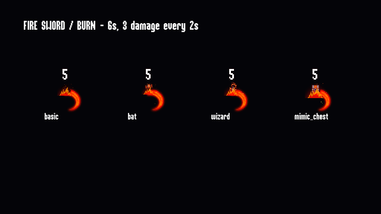
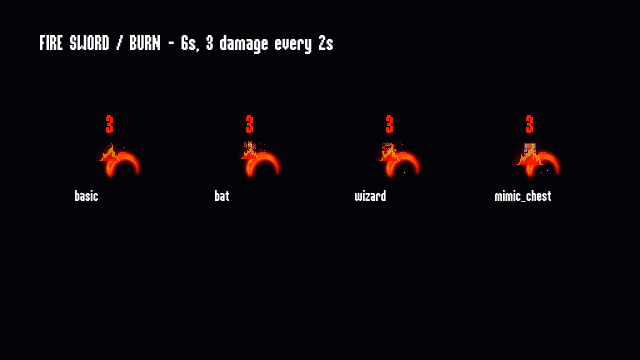
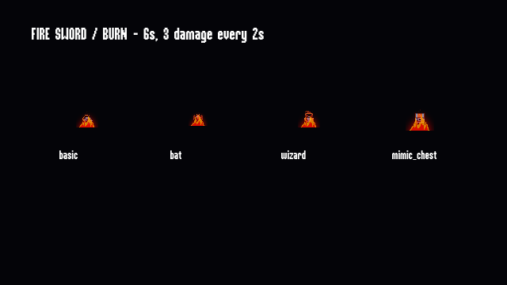

# 剑火焰附魔与灼烧

实现日期：2026-09-19。兼容基准：Godot `4.3.stable.official.77dcf97d8`。

## 使用与配置

剑控制器场景现在默认引用 [`resource/buffs/sword_fire.tres`](../resource/buffs/sword_fire.tres)。在 Inspector 打开该资源即可调整：

| 属性 | 默认值 | 行为 |
| --- | --- | --- |
| `duration` | 6 秒 | 每次有效命中刷新敌人的剩余灼烧时间 |
| `tick_interval` | 2 秒 | 首次灼烧等待完整间隔；运行时要求至少 0.05 秒 |
| `tick_damage` | 3 | 每跳伤害，支持小数，独立于剑直接伤害升级 |
| `damage_color` | 橙红色 `(1, 0.38, 0.08, 1)` | 只影响灼烧飘字；普通攻击仍使用原有白色 |

在 `SwordAbilityController` 的 `burn_config` 属性清空引用即可关闭火焰附魔；新生成的剑恢复普通攻击。已经施加到敌人上的灼烧按原剩余时间结束。

第一版为默认附魔，尚未加入局内升级卡、商店或存档字段。现有升级 ID 和 `user://game.save` 结构不变。

## 行为规则

- 默认首次命中后第 2、4、6 秒各结算一次灼烧，最后一跳结算后到期。同一帧跨过多个间隔时按实际有效时间补跳，不结算到期后的伤害。
- 每个敌人只有一个灼烧实例。重复命中刷新剩余时间，不重置下一跳，避免高攻速让灼烧永远无法触发。
- 持续时间短于跳伤间隔时没有伤害跳数。无效、非有限数值或过小间隔拒绝施加。
- 刷新时复制最新配置数值，但保留当前下一跳倒计时；之后的间隔采用新配置。配置 Resource 不保存剩余时间，各敌人互不影响。
- 灼烧继承战斗暂停状态；升级、暂停与结算暂停期间停止逻辑计时。
- 到期清理状态与视觉节点。敌人死亡后随实体释放；已经致死的目标不继续施加灼烧或产生后续伤害数字。
- 周期伤害经过 `HealthComponent.damage()`，保留生命变化、闪白、死亡与经验掉落，但不发送物理命中的 `HurtboxComponent.hit` 信号，避免每跳重播命中音效。
- 巫师半血行为改为监听生命变化，直接攻击和灼烧都能触发，且只切换一次。同步修复 `disappear` 动画 0.7 秒处 `set_is_moving` 缺少参数的问题，明确传 `false`。
- 生命组件的延迟死亡检查增加一次性保护，防止直接攻击与灼烧在同一帧造成重复死亡／掉落。

## 组件与表现

```text
SwordAbilityController.burn_config
  → SwordAbility（生成前设置配置）
  → HitboxComponent.burn_config
  → HurtboxComponent.on_area_entered（剑直接伤害）
  → BuffManager.add_burn（创建或刷新 BurnBuff）
  → BurnBuff.advance（独立周期计时）
  → HurtboxComponent.apply_periodic_damage
  → HealthComponent.damage + 彩色 FloatingText
```

四种敌人场景显式绑定了 `BuffComponent`、生命组件与 Hurtbox。场景导出属性 `burn_visual_offset`、`burn_visual_scale` 可分别调整燃烧位置和尺寸。

复用已有 `BuffBase / BuffManager`，新增 `advance()` 调度入口；治疗仍使用原先的首帧触发和 15 秒间隔。灼烧覆盖该入口，采用独立倒计时。BuffManager 过期时调用现有拼写的 `destory_buff()`，默认释放节点；灼烧同时清理挂在敌人身上的视觉节点。

美术素材在 [`asserts/vfx/fire/`](../asserts/vfx/fire/)，来源、许可与哈希见 [LICENSES.md](../asserts/vfx/fire/LICENSES.md) 和 [manifest.json](../asserts/vfx/fire/manifest.json)。

- 剑：Cethiel Fire 第 1 组 6 帧，以 20 FPS 播放，叠加 Kenney 火星粒子。火焰节点挂在剑的 Sprite2D 下，跟随现有旋转与缩放。
- 敌人：para `fire_01.png` 按 8 × 8、128 × 128 单帧切分，30 FPS 循环，叠加 Kenney 火星。视觉挂在敌人根节点下，跟随位置但保持火焰向上，不随敌人的左右镜像翻转。
- `swing` 方法轨道在 0.1 秒开始发射、0.4 秒停止；火星寿命 0.25 秒，在原有 0.75 秒释放剑之前消散。碰撞窗口仍是原来的 0.1–0.4 秒。

## 已验证

全部运行位于隔离副本 `blood-fire-check-tmvrffx7`，使用独立用户目录 `Codex-blood-fire-check-tmvrffx7`，未运行原项目或改动真实 `2DBlood` 存档。

| 检查 | 结果 | 证据 |
| --- | --- | --- |
| 冷导入 | 首次出现基线已记录的字体、UI、音乐、转场导入缓存缺失错误 | [import.log](verification/fire-20260919/import.log) |
| 缓存生成后导入 | 无错误输出 | [import-warm.log](verification/fire-20260919/import-warm.log) |
| 专项回归，headless | 34 项检查、0 失败；无脚本错误；退出有对象／5 个资源仍使用的诊断 | [regression.log](verification/fire-20260919/regression.log) |
| 专项回归，实际 Forward+ | 同样 34 项检查、0 失败；退出有对象／1 个资源仍使用的诊断 | [regression-gpu.log](verification/fire-20260919/regression-gpu.log) |
| 主菜单 180 帧 | 入口加载；退出有对象／1 个资源仍使用的诊断 | [menu.log](verification/fire-20260919/menu.log) |
| 战斗 1200 帧 | 早期战斗、难度 1/2、拾取与死亡结算实际执行，无脚本错误；退出有对象／19 个资源仍使用的诊断 | [combat.log](verification/fire-20260919/combat.log) |
| 独立视觉场景，Forward+ / Apple M4 | 检查四类敌人的火焰、挥砍和白色／橙红飘字；未见纹理缺失；退出仍有 1 个资源诊断 | [visual.log](verification/fire-20260919/visual.log)、下方截图 |

回归脚本是新增的独立场景 [`test/fire_buff_regression.tscn`](../test/fire_buff_regression.tscn)，未挂入主场景，也不是原来的实验节点 `test/Test.tscn`。覆盖首跳和到期边界、低帧率补跳、持续刷新、实例复用、跟随、暂停／恢复、小数伤害与自定义间隔、无效配置、敌人间状态独立、巫师状态轨道、灼烧击杀和一次掉落、普通攻击、治疗与剑特效生命周期。

按 [开发基线](development/DEVELOPMENT.md#隔离运行) 准备副本和唯一测试用户目录，先导入，再执行：

```sh
# CHECK_PROJECT 必须是修改了 custom_user_dir_name 的隔离副本，不能指向原工作区。
/Applications/Godot.app/Contents/MacOS/Godot --headless --path "$CHECK_PROJECT" --fixed-fps 60 --quit-after 300 res://test/fire_buff_regression.tscn
```

必须看到 `FIRE_REGRESSION: 34 checks, 0 failures`，并检查完整错误输出。帧数上限退出本身不是测试通过证据。移除 `--headless` 可在当前 Forward+ 渲染器下运行同一回归。







截图来自隔离展示场景，直接伤害配置为 5；没有更改正式游戏的地图或 UI。

## 验证边界

退出诊断与基线表现同类，但具体对象来源未定位，不能宣称零错误或认定它们全部来自旧代码。本轮没有进行大规模同屏燃烧性能基准、完整 300 秒通关、升级 UI 手动交互、声音听感、触屏或移动端／Web 导出验证。截图和短时间真实渲染不能替代这些检查。
