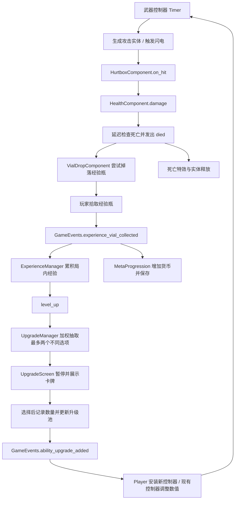

# 项目知识地图

依据：2026-09-17 工作区与基准提交 `96cb1c0`。这是当前实现的说明，不是完整产品规格。

## 项目概况

| 项目项 | 当前事实 |
| --- | --- |
| 引擎与语言 | Godot 4.3，GDScript；`project.godot` 声明 Forward Plus |
| 游戏类型 | 俯视角 2D 生存动作；移动躲避、自动攻击、经验升级与局外成长 |
| 游戏名称 / 配置版本 | `blood` / `1.0.0` |
| 画面 | 640 × 360 逻辑视口，viewport 拉伸，最近邻纹理过滤 |
| 局长 / 难度 | 300 秒，每 5 秒提升一次难度 |
| 输入 | WASD / 方向键移动，P 对应动作 `暂停`；另有虚拟摇杆 |
| 规模 | Git 跟踪的 65 个 `.gd`、59 个 `.tscn`、28 个 `.tres`、6 个 `.gdshader` |
| 导出配置 | Windows Desktop、Web、Android；存在预设不代表已验证导出 |

目前没有外部插件目录、通用自动测试框架或 CI 配置。后续新增了独立的宝箱怪回归场景 `test/mimic_regression.tscn`，以及火焰和战斗实验场回归。本次地图来自源码与场景交叉阅读。

## 目录职责

```text
project.godot            引擎、入口、Autoload、输入、碰撞层、全局主题
sences/                 原有目录拼写，所有主要场景与脚本
  main/                 战斗总装配、死亡结算与暂停入口
  autoload/             全局事件、音乐、转场、永久成长、更新日志
  manager/              计时难度、敌人生成、经验等级、局内升级
  game_object/          玩家、四种敌人、经验瓶、摄像机
  component/            生命、移动、攻击/受击、掉落、音效、Buff 等
  ability/              自动武器控制器、攻击实体、宝箱怪吸引能力
  buff/                 Buff 基类、治疗与灼烧实现；冰目录目前只有图片
  ui/                   主菜单、暂停、结算、升级、设置、摇杆等
resource/               自定义资源类及 .tres 配置
  upgrades/             局内武器解锁和数值升级
  meta_upgrades/        局外升级定义
  Beastiary/            敌人图鉴数据，保留现有大小写与拼写
  theme/                字体和主题
  changelog/            更新日志数据对象
asserts/                美术、音效、音乐、字体包，保留原拼写
scripts/weighted_table.gd  敌人和升级共用的加权随机表
test/                   原有实验场景，以及独立的宝箱怪自动回归场景
```

## 场景装配与生命周期

入口是 `sences/ui/main_menu.tscn`。开始按钮等待 `ScreenTransition.transitioned_halfway`，然后切换到 `sences/main/main.tscn`。

主场景的关键组成：

```text
Main
├── Vignette / ArenaTimeUI / ExperienceBar
├── Joypad / VirtualJoypad
├── ArenaTimeManager
├── EnemyManager              导出字段指向 ArenaTimeManager
├── ExperienceManager
├── UpgradeManager            expericen_manager 指向 ExperienceManager
├── GameCamera
├── TileMap                   实际类型是 TileMapLayer
├── Entities                  Group: entites_layer，启用 Y 排序
│   └── Player                场景唯一名，Group: player
│       ├── HealthComponent / VelocityComponent / BuffComponent
│       ├── Abilities / SwordAbilityController
│       ├── PickupArea2D / CollisonArea2D
│       └── Visuals / AnimationPlayer / HealthBar / 音效与计时器
├── Foreground                Group: foreground_layer
│   └── 六个预放置经验瓶
└── Test                      实例化 test/Test.tscn
```

敌人与掉落通常动态加入 `Entities`；武器、闪电与伤害飘字通常加入 `Foreground`。挂接位置会影响渲染顺序和节点生命周期。

玩家死亡：`HealthComponent.died → main.gd.on_player_died → EndScreen.set_defeat()`。计时结束：`ArenaTimeManager.on_timer_timeout → EndScreen`，显示胜利并播放音效。两条路径都保存局外数据；EndScreen 暂停场景树，离开时解除暂停。

## 全局服务

以下名称是 `project.godot` 注册的 Autoload，不能当普通类名随意替换。

| 名称 | 职责与契约 |
| --- | --- |
| `GameEvents` | `experience_vial_collected(number)`、`ability_upgrade_added(upgrade, current_upgrades)`、`player_damaged`、`player_heal` |
| `MusicPlayer` | 音乐播放结束后通过 Timer 再次播放 |
| `ScreenTransition` | 转场动画及中点信号；中点信号通过动画方法调用触发 |
| `MetaProgression` | 读取/保存局外货币和升级，监听经验收集 |
| `ChangelogPorgress` | 解析 `res://ChangeLog.md`，供更新日志菜单读取 |

局部信号优先由相邻节点连接，全局事件用于跨系统同步；不是所有信号都需要增加到 GameEvents。

## 核心事件链



### 战斗与组件

- 普通武器的 `HitboxComponent` 保存伤害值及可选 BurnConfig；敌人 `HurtboxComponent` 监听区域进入，调用生命组件并显示飘字、发出受击信号。
- 闪电例外：直接调用敌人的 `hurtbox_component.on_hit()`，不经 Hitbox 物理接触。新增敌人需要维持这个可访问字段。
- 玩家受伤是另一条链：`CollisonArea2D.body_entered/exited` 统计接触敌人，`DamageIntervalTimer` 控制每 0.5 秒扣 1 点生命。不能假设玩家和敌人的受伤入口完全一致。
- `HealthComponent.damage()` 正数扣血，负数治疗；死亡检查延迟执行，以一次性保护发出 `died` 后释放 `owner`。掉落和死亡特效依赖这个时序。
- `VelocityComponent` 处理加速、追踪玩家和 `move_and_slide()`；玩家与多数敌人在 `_process()` 调用它。
- 玩家永久 Buff 来自 `MetaProgression.get_meta_buff_upgrade_info()`，由 BuffManager 实例化。名称注册表仅 `buff_heal`；敌人灼烧由独立 `add_burn()` 接口创建／刷新；治疗场景配置永久生效、15 秒触发间隔，首次触发时机由 BuffBase 的计时条件决定。

- 正式默认剑不带火焰 Buff。选择 `剑:火焰附魔` 卡牌后才注入 `resource/buffs/sword_fire.tres`，测试火焰机制默认 6 秒、每 2 秒 3 点；四种敌人都绑定 BuffComponent，卡牌上限 1，见 [火焰实现](../FIRE_BUFF.md)。

### 生成与难度

`EnemyManager` 通过 WeightedTable 抽取敌人，在玩家周围半径 200 的位置生成，并用地形射线尝试避开障碍。初始普通敌人权重 30；难度 3 加入巫师（20），难度 6 加入蝙蝠（10），难度 8 加入宝箱怪（5）。前两次解锁还各增加一次生成数量，计时器间隔也随难度缩短。

普通敌人和蝙蝠追踪玩家；巫师由动画轨道切换移动状态，通过生命变化信号在半血时一次进入特殊表现（包含灼烧伤害）。宝箱怪使用休息、唤醒、追逐、入睡四态，动画完成信号推进状态；追逐时注册吸力源，由玩家汇总外部速度后统一移动。详细参数、玩法和已修复的动画时序问题见 [宝箱怪声明](../monsters/MIMIC_CHEST.md)。

独立实验场通过 EnemyManager 的可选 `test_enemy_scene` 固定怪物并屏蔽难度扩池；正式场景默认 null。使用方式见 [战斗实验场](../development/COMBAT_LAB.md)。

### 升级资源

`AbilityUpgrade extends Resource` 提供 `id / max_quantity / name / description`。`Ability extends AbilityUpgrade` 增加 `ability_controller_scene`；Player 收到这类升级时将控制器挂入 `Abilities`。

| 武器 | 解锁方式 | 当前关联升级 |
| --- | --- | --- |
| 剑 | 玩家场景默认自带 | `剑:攻速升级`、`剑:伤害升级`、`剑:火焰附魔`；解锁后有火焰伤害、持续时间、频率三条强化线 |
| 斧头 | `axe.tres`，ID `斧头` | `斧头:伤害升级` |
| 铁毡 | `anvil.tres`，ID `铁毡` | `铁毡:伤害升级`、`铁毡:数量升级` |
| 巨剑 | `huge_sword.tres`，ID `巨剑` | 当前没有对应数值升级资源 |
| 闪电 | `thunder.tres`，ID `闪电` | 距离、伤害、人数、数量、频率 |

各武器的核心 GDScript、数值公式、升级表和变种见 [武器学习手册](../weapons/README.md)。UpgradeManager 的 `test_weapon_id` 默认空串，不筛选；独立实验场按武器 ID 过滤候选，空池时不打开升级界面。

初始升级池另含 `玩家移速`。解锁武器后，UpgradeManager 将对应强化项加入池中；达到 `max_quantity > 0` 的上限后移除。当前最多抽两张卡。新增 `.tres` **不会自动注册**到升级池。

`current_upgrades` 的结构为 `{升级ID: {"resource": AbilityUpgrade, "quantity": 次数}}`。修改 ID 要同时检查资源、控制器条件和读取数量的字典键。

## 持久化

文件：`user://game.save`，使用 `FileAccess.store_var/get_var`，不是 JSON。项目自定义用户目录名 `2DBlood`；本机 macOS 对应 `~/Library/Application Support/2DBlood/`。

```text
save_data = {
  "meta_upgrade_currency": 数值,
  "meta_upgrades": {
    "经验获取": {"quantity": 次数},
    "buff_heal": {"quantity": 次数}
  }
}
```

经验瓶同时增加局内经验和局外货币。局外升级菜单使用 `MetaUpgrade` 的价格和上限决定购买按钮状态，购买后扣款并保存。启动时无条件增加这两项永久升级是当前实现，已在开发基线中列为待处理问题。

## 字符串与场景约定

| 类型 | 当前值 / 用途 |
| --- | --- |
| Group | `player`、`enemy`、`entites_layer`、`foreground_layer`、`upgrade_card`、`meta_upgrade_card`；动态吸力源组 `suction_sources` |
| 输入动作 | `move_left/right/up/down`、`left_click`、`暂停` |
| 音频总线 | `Master`、`sfx`、`music` |
| 常见节点访问 | `$HealthComponent`、`$Abilities`、`%Player`、`%CardContainer` |

碰撞层的编辑器编号从 1 开始，位掩码是 `1 << (编号 - 1)`：

| 编号 / 位值 | 配置名称 | 已观察到的实际用途 |
| --- | --- | --- |
| 1 / 1 | 地形 | 地图碰撞、生成位置射线 |
| 2 / 2 | 玩家 | 已命名；不能仅凭名称推断玩家当前使用该层 |
| 3 / 4 | 敌人 | Hitbox 的 layer=4、Hurtbox 的 mask=4，即攻击判定通道 |
| 4 / 8 | 敌人碰撞 | 敌人实体层；玩家接触伤害区 mask=8 |
| 5 / 16 | 玩家拾取 | 玩家拾取区域 layer=16 |

特别注意：主场景 Player 实例覆盖了 `collision_layer = 0`。只读 `player.tscn` 或碰撞层名字会得出不完整结论。

## 常见任务从哪里开始

| 任务 | 优先阅读 / 修改位置 |
| --- | --- |
| 加武器 | 同类 ability + controller → Ability 资源 → UpgradeManager 池 → Player 安装逻辑 |
| 加敌人 | 同类敌人场景及组件 → EnemyManager 场景导出绑定 → 加权表和解锁条件；图鉴是独立数据 |
| 调数值 | 对应 `.gd` 常量、`.tres` 资源和 `.tscn` Inspector 覆盖共同核对 |
| 加 Buff | BuffBase → 实现与场景 → BuffManager.buff_list；永久 Buff 再接 meta 资源与菜单 |
| 改移动 / 手机操作 | player.gd → VelocityComponent → touch_screen_button.gd → 输入动作 |
| 改存档 / 商店 | MetaProgression → MetaUpgrade 资源 → meta_upgrade_card.gd |
| 改菜单 / 暂停 | 对应 CanvasLayer 场景、`process_mode`、暂停设置及转场轨道 |

图鉴已有 `monster_menu` 场景和资源，但本次没有找到从主菜单进入的引用；不能将“有代码”直接理解为“玩家可访问”。`ChangeLog.md` 同时包含计划项，也不能代替实现状态核实。
