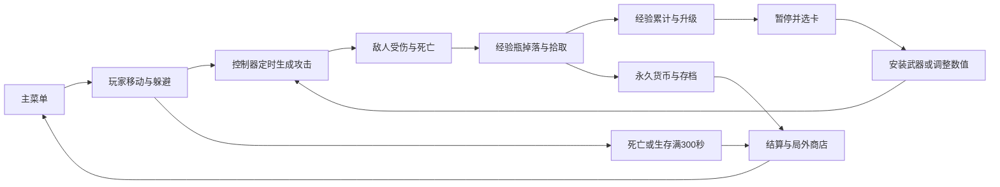
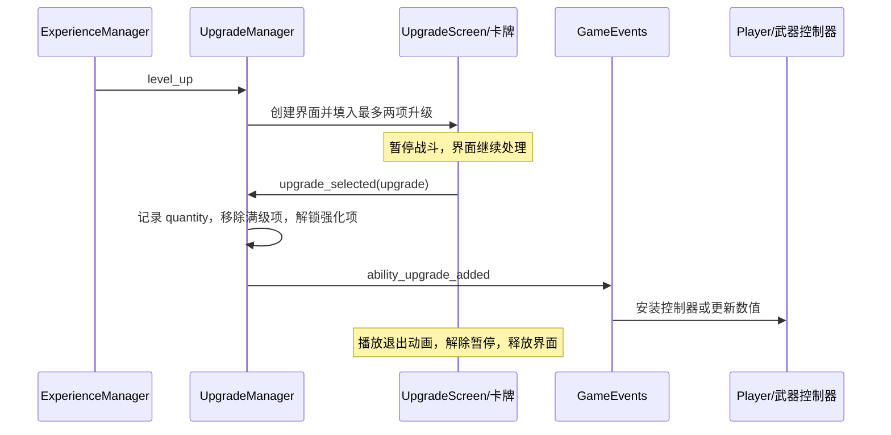

# 从课程重新理解这个 Godot 生存游戏

这份指南用来恢复“我当时为什么这样设计、现在代码在哪里、下一步怎样继续改”的记忆。它按你提供的课程路线组织，以 **2026-09-17 当前工作区**为依据，包括尚未提交的宝箱怪修改。

没有课程视频或历史阶段源码可供逐帧比对，所以“课程对应”表示课程主题与当前实现的对应关系，不表示视频中的原始操作、数值与现在完全相同。文中“练习”和“验收”是建议你在隔离副本里操作的步骤，不是本次已经执行的游戏测试。

配套阅读：

- [81 节课程逐节对照](COURSE_MAP.md)：保留原英文标题和时长，按课定位。
- [Godot 编辑器设置速查](GODOT_EDITOR_GUIDE.md)：按“打开什么 → 选哪个节点 → 看什么属性”查找。
- [项目知识地图](../architecture/ARCHITECTURE.md)：查系统职责和现有约定。
- [开发与验证基线](../development/DEVELOPMENT.md)：隔离运行、已知缺陷、回归范围。

<a id="route"></a>
## 0. 大纲：沿着玩家的一局游戏恢复知识

| 顺序 | 要回答的问题 | 建议先读 |
| --- | --- | --- |
| 1 | Godot 怎样把脚本、节点和资源组装成游戏？ | [基本概念](#concepts) |
| 2 | 玩家怎样出现在地图上、移动并被摄像机跟随？ | [玩家、地图与摄像机](#world) |
| 3 | 自动攻击怎样选目标、造成伤害、杀死敌人？ | [战斗闭环](#combat) |
| 4 | 谁负责一局的时间、敌人数量和难度？ | [局内管理](#arena) |
| 5 | 敌人死亡怎样推动玩家变强？ | [经验与升级](#upgrades) |
| 6 | 如何加入第二种武器，而不把 Player 写成巨型脚本？ | [扩展武器](#abilities) |
| 7 | 动画、粒子、声音怎样让结果更容易被感知？ | [动画与反馈](#feedback)、[音频](#audio) |
| 8 | UI 怎样布局、暂停游戏并完成菜单转场？ | [UI](#ui)、[菜单](#menus) |
| 9 | 一局结束后，哪些数据需要留下？ | [永久成长与存档](#meta) |
| 10 | 当前自己的扩展怎样接在课程之上？ | [扩展内容](#extensions) |
| 11 | 怎样用小练习恢复独立开发能力？ | [重做练习](#practice)、[排查方法](#debug) |

第一次不要从头默读所有脚本。先打开 `main.tscn`，顺着下面这张图走一圈，再选择一个系统深入。



设计时的顺序很重要：先让玩家能移动，再让一次攻击有结果，再让结果带来成长，最后改善表现、菜单和发布。这样每一步都有一个可观察的闭环，不需要一开始就设计完整框架。

### 0.1 用三层视角读任何一个功能

以后忘记某个系统时，不要只搜函数名。先问三层问题：

| 层次 | 要回答的问题 | 以“剑”为例 |
| --- | --- | --- |
| 设计层 | 玩家应感知到什么？为什么现在就做它？ | 玩家无需按攻击键，也能感到自己在持续变强 |
| 装配层 | 哪些 Scene、Node、Resource 和 Inspector 引用共同组成它？ | Player 下的 Controller、一次性剑场景、Timer、Hitbox、升级资源 |
| 运行层 | 哪个事件启动，数据经过谁，何时结束？ | Timer timeout → 选最近敌人 → instantiate → 动画开启碰撞 → queue_free |

只看设计层会停在想法，只看装配层容易变成机械点编辑器，只看运行层则容易写出能跑但难扩展的大脚本。本指南每一阶段都尽量把三层连起来。

### 0.2 原课程为什么按这个顺序推进

| 阶段 | 先解决的问题 | 这一阶段完成后获得的闭环 |
| --- | --- | --- |
| A 环境与世界 | 引擎、玩家、输入、地图、摄像机 | 一个可移动、可观察、不会轻易迷失方向的原型 |
| B 战斗与成长 | 敌人、自动攻击、伤害、经验、选卡、胜败 | 一局“战斗—成长—结算”完整可玩 |
| C 内容与表现 | 难度、更多武器敌人、动画、主题和反馈 | 证明架构可扩展，并让结果清晰、有手感 |
| D 声音 | 世界音效、UI 音效、音乐 | 用听觉区分事件、空间与界面层次 |
| E 菜单与永久成长 | 场景流、设置、暂停、存档、发布 | 把一局玩法包装成可重复进入的游戏产品 |
| F 再扩展 | 新敌人、铁砧、回血 Buff、粒子 | 独立复用既有模式，而不是照抄第一种实现 |

每个阶段都先建立最小可验证版本，再抽象复用点。不要倒过来先做“万能武器基类”或“大一统管理器”；当第二种相似需求出现时，再根据真实差异抽象更可靠。

<a id="concepts"></a>
## 1. 先恢复 Godot 的六个基本概念

### 1.1 Node、Scene、Script、Resource 各自管什么

| 概念 | 在本项目中的例子 | 你可以怎样理解 |
| --- | --- | --- |
| Node 节点 | Timer、Sprite2D、CharacterBody2D | 一个具体能力：计时、显示或碰撞移动 |
| Scene 场景 `.tscn` | `player.tscn` | 一棵可保存、可重复实例化的节点树；不限于“关卡” |
| Script 脚本 `.gd` | `player.gd` | 挂在节点上的行为逻辑 |
| Resource 资源 `.tres` | `axe.tres`、Theme、TileSet | 可保存、可在 Inspector 编辑的配置；普通 Resource 不自动加入场景树执行 |
| Signal 信号 | `HealthComponent.died` | 告知订阅者发生了什么，减少双方直接依赖 |
| Group 分组 | `player`、`enemy` | 在运行中的场景树里按身份找节点，与物理碰撞层无关 |

打开 [玩家场景](../../sences/game_object/player/player.tscn)，你看到的不是一个“玩家类包含所有功能”，而是一个 `CharacterBody2D` 配上显示、移动、血量、拾取、攻击控制器等子节点。打开 [玩家脚本](../../sences/game_object/player/player.gd)，它主要负责协调这些部件。

组件化的实际收益是：敌人也需要血量和移动，因此可以实例化相同组件场景。继承则用于明确的类型关系，例如 `Ability extends AbilityUpgrade`、`HealBuff extends BuffBase`。两者在项目中同时使用。

### 1.2 读脚本时先看这些语法

| 语法 | 这里的用途 | 容易忘记的地方 |
| --- | --- | --- |
| `extends CharacterBody2D` | 给带碰撞移动的节点扩展行为 | 脚本类型必须适配挂载节点 |
| `class_name HealthComponent` | 注册可引用的脚本类型 | 它不是 Autoload，也不会自动创建全局实例 |
| `@export var ...` | 在 Inspector 暴露配置和节点引用 | 脚本默认值可能被 `.tscn` 中的实例覆盖 |
| `@onready var ... = $HealthComponent` | 入树准备完成时取子节点 | `$` 是相对节点路径；节点改名会影响它 |
| `%Player`、`%NameLabel` | 找场景唯一名节点 | 依赖节点启用“作为唯一名称访问”，不是全局名字查找 |
| `preload()` / `load()` | 取得场景、脚本或资源 | `preload` 提前加载；拿到 PackedScene 还要实例化 |
| `instantiate()` / `add_child()` | 创建节点树并放进运行场景 | 两步不同；加入活动场景树时会触发生命周期回调 |
| `.connect()` / `.emit()` | 监听和发出事件 | 编辑器信号页没连接，也可能在 `_ready()` 中连接了 |
| `.bind(upgrade)` | 给回调附带额外参数 | 卡牌 selected 不传资源，绑定后回调仍可知道选的是哪张 |
| `await` | 等动画或信号后继续 | 等待期间对象可能已销毁，要考虑有效性 |
| `queue_free()` | 请求稍后删除节点 | 删除父节点会连同孩子一起删除 |
| `call_deferred()` | 把操作延迟到安全时机 | 碰撞回调里改检测形状、释放实体时尤其相关 |

### 1.3 同一个数值为什么有时改了不生效

按 **脚本默认值 → 组件场景 → 玩家/敌人场景中的组件实例 → 主场景中的实例 → 运行时赋值** 逐层检查。

例如 [VelocityComponent](../../sences/component/velocity_component.gd) 默认速度是 40；玩家场景给自己的组件覆盖为 125、加速度 25；局内移速升级还会运行时重设 `max_speed`。只改组件默认 40，不能改变已经覆盖该属性的玩家。

另一个例子：`player.tscn` 根节点未显式写出碰撞层，使用引擎默认值；`main.tscn → Entities/Player` 又覆盖 `collision_layer = 0`。阅读原场景和实例所在场景都不可省略。

### 1.4 局部信号与全局事件怎样分工

相邻系统有明确引用时直接连接，例如 EnemyManager 引用 ArenaTimeManager。多个系统都关心拾取经验时，通过 [GameEvents](../../sences/autoload/game_events.gd) 广播：ExperienceManager 增加局内经验，MetaProgression 增加永久货币。

GameEvents 是在 `project.godot` 注册的 Autoload。它比某一局战斗活得更久，但场景里的玩家、敌人、升级管理器会随切换场景重建。

**自检：** 能解释“斧头场景资源”“斧头实例”“玩家身上的斧头控制器”三者区别，再继续读后面。

### 1.5 从空项目搭一个节点、挂脚本、连信号

这是一套最小操作闭环，后面创建敌人、武器和 UI 时都会重复：

1. 在顶部选择“场景 → 新建场景”，选合适根节点；可移动实体优先 `CharacterBody2D`，纯组织可用 Node/Node2D，界面用 Control。
2. 在 Scene 树点“添加子节点”，用类型名搜索。节点名应表达职责，如 `Visuals`、`CollisionShape2D`、`HealthComponent`，而不是 `Node2D2`。
3. 选择根节点，点击“附加脚本”，确认继承类型与节点匹配；保存脚本后再保存 `.tscn`。Scene 是装配，Script 是行为，两者不是同一个文件。
4. 若字段使用 `@export`，编译后在 Inspector 赋值：Node 字段可从 Scene 树拖节点，PackedScene/Resource 字段从 FileSystem 拖文件。
5. 连接信号有两种方式：在右侧 Node → Signals 双击信号生成静态连接，或在 `_ready()` 中写 `source.signal.connect(callback)`。本项目大量使用后者，所以 Node 面板没有连线不代表没人监听。
6. 要复用该场景，在另一个场景中点击“实例化子场景”或把 `.tscn` 从 FileSystem 拖入 Scene 树。修改原场景会影响所有实例；单个实例的 Inspector 覆盖只影响该实例。
7. 运行后从 Scene 面板切到 **Remote**，核对实际生成的节点、运行时属性和动态控制器；停止运行后回到 Local，避免把运行值误认为已保存配置。

```gdscript
# 一条局部信号链的最小形态。
signal finished(value)

func _ready():
    finished.connect(on_finished)

func do_work():
    finished.emit(1)

func on_finished(value):
    print(value)
```

编辑器自动生成的连接常把连接信息序列化到 `.tscn`，代码连接则写在 `.gd`。排查时两处都要看。更详细的点击位置见[创建、实例化、连接与 Remote](GODOT_EDITOR_GUIDE.md#scene-workflow)。

<a id="world"></a>
## 2. 第一阶段：玩家、地图与摄像机

对应课程 A01–A06。

### 2.1 先搭一个最小玩家

思考顺序：我需要一个能显示的角色 → 它不能穿墙 → 它要读取输入 → 表现可以独立变化。

1. 以 `CharacterBody2D` 为根节点，用于 `move_and_slide()`。
2. 添加 `CollisionShape2D` 表示实体碰撞，形状围绕脚下区域布置。
3. 用 `Visuals/Sprite2D` 显示角色。把外观放在 Visuals 下，翻转或动画不必改变所有碰撞形状。
4. 将移动方向交给 VelocityComponent，Player 保留输入与协调职责。
5. 将场景实例放进 `main.tscn → Entities`，加入 `player` 组，让摄像机和武器控制器能找到它。

当前节点结构可在 [player.tscn](../../sences/game_object/player/player.tscn) 核对。血条、Buff 和音效是后续阶段加上的，复习初始搭建时先聚焦上述部分。

### 2.2 从输入到位移，每一层只回答一个问题

在 [player.gd](../../sences/game_object/player/player.gd) 按顺序读 `get_movement_vector()` 和 `_process()`，再读 [velocity_component.gd](../../sences/component/velocity_component.gd) 的 `accelerate_in_direction()`、`move()`。

```text
Input Map 的动作强度
  → 右减左、下减上得到二维向量
  → normalized() 得到方向
  → 方向 × max_speed 得到目标速度
  → lerp 平滑逼近目标速度
  → CharacterBody2D.velocity
  → move_and_slide() 处理实际位移和碰撞
```

为何归一化？同时向右和向下时 `(1, 1)` 长度是 √2，不归一化就会斜向更快。当前输入无论来自键盘还是摇杆都被归一化，因此摇杆非零强度也会转成单位方向，并非完整保留模拟走路速度。

平滑系数 `1 - exp(-acceleration * delta)` 会随帧间隔调整；它表达“按时间逐渐靠近目标”。现有代码在 `_process()` 移动，`move_and_slide()` 使用速度而不是“速度乘 delta 后的位移”。不要在复习时顺手再乘一次 delta，也不要把切换到 `_physics_process()` 混进无关修改。

当前 `_process()` 多了一段宝箱吸力汇总，这是后期扩展，先略过，读完基础移动后看第 12 节。

**编辑器定位：** [输入动作与玩家参数](GODOT_EDITOR_GUIDE.md#player)。

**练习：** 在隔离副本把玩家组件的 Max Speed 从 125 改成 80，再只改 Acceleration，分别感受最高速度与加速过程的区别。预期斜向不会更快，撞墙时仍受碰撞限制。这里的手感需实际操作验证。

### 2.3 地图分为“瓷砖规则”和“摆放结果”

当前 [main.tscn](../../sences/main/main.tscn) 的节点叫 `TileMap`，实际类型是 **TileMapLayer**。这是 Godot 4.3 项目现状，不能只按旧课程的 TileMap 界面找选项。

- [tileset.tres](../../resource/tileset.tres) 存纹理图集、各瓷砖碰撞多边形及地形连接规则。
- TileMapLayer 存“哪一个格子放哪一块砖”的地图数据。
- TileSet 的物理层使用第 1 层“地形”；只有画了碰撞多边形的瓷砖才有对应实体障碍。
- `floor` Terrain 的边与角匹配帮助自动连接地面；它不是寻路数据。

设计时先画可通行区域，再加边界碰撞，再改善地形连接。若画面是墙但能穿过去，先查瓷砖的碰撞多边形和角色 Mask，不要先查贴图。

**编辑器定位：** [TileSet 和地图](GODOT_EDITOR_GUIDE.md#tilemap)。

### 2.4 摄像机跟随哪个对象

[game_camera.gd](../../sences/game_object/game_camera/game_camera.gd) 在 `_ready()` 调用 `make_current()`，每帧从 `player` 组寻找目标，再把自身 `global_position` 平滑移动过去。

摄像机是主场景的兄弟节点，未挂在玩家下面。这样玩家死亡和释放后，不必把摄像机一起释放；脚本也会在没找到玩家时保留之前的目标位置。当前平滑由脚本实现，不是仅勾选 Camera2D 的 Position Smoothing。

<a id="combat"></a>
## 3. 第二阶段：敌人、自动剑与伤害闭环

对应 B01–B08、B12–B13、B20–B21。

### 3.1 第一个敌人先只学会追踪

阅读 [basic_enemy.gd](../../sences/game_object/basic_enemy/basic_enemy.gd) 与 [basic_enemy.tscn](../../sences/game_object/basic_enemy/basic_enemy.tscn)。课程叫 Rat Enemy，当前代码对应 `basic_enemy`，场景根名保留 `BasicEnermy`。

敌人的方向来自“玩家位置减自身位置”，与玩家共用 VelocityComponent。区别是玩家方向来自输入，敌人方向来自追踪算法。`enemy` 组提供身份；外观朝向通过 `Visuals.scale` 改变。脚本中的 `MAX_SPEED = 40` 没有用于实际移动，真正生效的是组件参数。

### 3.2 为什么剑分为 Controller 和 Ability

| 角色 | 当前文件 | 决策 |
| --- | --- | --- |
| 控制器 | [sword_ability_controller.gd](../../sences/ability/sword_ability_controller/sword_ability_controller.gd) | 什么时候打、打谁、伤害是多少 |
| 攻击实例 | [sword_ability.gd](../../sences/ability/sword_ability/sword_ability.gd) 与同名场景 | 这一次攻击长什么样、何时生效、何时消失 |

控制器长期挂在 `Player/Abilities`；每次挥剑生成短命实例，放到 `foreground_layer`。控制器可以独立升级攻击频率，攻击场景可以独立编辑动画，双方通过导出 PackedScene 字段连接。

`on_timer_timeout()` 的思考顺序：

1. 找玩家；没有玩家就结束，避免结算后继续攻击。
2. 找 `enemy` 组所有敌人，按与玩家的距离平方筛选。距离平方比较无需开平方。
3. 排序选最近目标；范围内无敌人就不生成剑。
4. 实例化剑并加入 Foreground，设置 Hitbox 伤害。
5. 在敌人位置附近随机偏移 4 像素，再用目标方向的 `angle()` 设置旋转。

当前剑基础伤害 5，控制器场景 `MAX_RANGE = 150`；Timer 未显式覆盖 Wait Time，使用 Godot 默认的 1 秒。剑不是始终在玩家中心挥动。

### 3.3 AnimationPlayer 也是程序的一部分

[sword_ability.tscn](../../sences/ability/sword_ability/sword_ability.tscn) 的 `AnimationPlayer` 自动播放 `swing`。轨道修改 Sprite2D 的旋转/缩放、CollisionShape2D 的 Disabled，并通过方法轨道调用根节点 `queue_free()`。

因此只读 4 行剑脚本，看不到攻击完整行为是正常的。一次攻击可以划分为准备、有效命中、收尾；碰撞启用时机要和动画配合。方法轨道相当于“在这个时间点调用这个函数”。

**编辑器定位：** [动画轨道](GODOT_EDITOR_GUIDE.md#animation)。

### 3.4 Hitbox、Hurtbox、实体碰撞不要混在一起

```text
剑的 HitboxComponent（Area2D，携带 damage）
  → 敌人的 HurtboxComponent.area_entered
  → 检查进入者是 HitboxComponent
  → HurtboxComponent.on_hit(damage)
  → HealthComponent.damage(damage)
  → 更新生命、发送受击反馈、延迟检查死亡
```

读 [hitbox_component.gd](../../sences/component/hitbox_component.gd)、[hurtbox_component.gd](../../sences/component/hurtbox_component.gd)、[health_component.gd](../../sences/component/health_component.gd)。Hitbox 是“攻击覆盖区域”；Hurtbox 是“能被攻击命中的区域”；CharacterBody2D 自己的形状用于实体移动阻挡。三者可以有不同大小。

**Layer 表示自己在哪些通道，Mask 表示检测哪些通道。** 本项目攻击区 layer=4，是编辑器第 **3** 层，不是第 4 层。详见 [碰撞矩阵](GODOT_EDITOR_GUIDE.md#collision)。

### 3.5 先通知死亡，再销毁拥有者

HealthComponent 的 `damage()` 把生命限制在 0～max_health，正伤害发 `health_changed`，然后延迟调用 `check_death()`。死亡时先发 `died`，再 `owner.queue_free()`。

这个顺序允许掉落组件读取敌人位置，死亡组件把自己从即将删除的敌人下移出，再播放残留特效。`owner` 是场景所有权关系，和 `get_parent()` 并非总是同一个对象；复用组件时必须放到正确场景结构中。

### 3.6 玩家受伤是另一条流程

当前玩家没有照搬敌人的 Hurtbox 接触流程，而是用 `CollisonArea2D.body_entered/body_exited` 统计接触的敌人实体数量。

`check_deal_damage()` 只在有接触、且 DamageIntervalTimer 停止时扣 1 点血，再启动 0.5 秒单次 Timer。Timer 到期再检查是否仍接触。这样避免每帧扣血；当前也不是每个接触敌人各扣 1 点。

玩家 `HealthBar.max_value = 1`，显示生命比例；HealthComponent 当前默认满血 10。Player 监听健康变化同步血条、播放声音并发出全屏受击事件。治疗走 `health_heal`，不要把“血量发生变化”一概当作受伤。

**验收思路：** 在隔离副本验证敌人追踪、剑命中扣血、死亡只出现预期掉落、贴身伤害有间隔、血条跟随变化。若剑出现但不扣血，先检查形状启用与碰撞层，再检查伤害值。

<a id="arena"></a>
## 4. 第三阶段：一局游戏、生成系统与难度

对应 B07、B09、B19、B22–B23、C01–C03、C10–C12、E13、F01。

### 4.1 谁负责“这一局”

[main.gd](../../sences/main/main.gd) 很短：连接玩家死亡、打开暂停菜单、显示失败结算。计时、生成、经验和升级分别交给四个 Manager，主场景负责装配引用。

| 节点 | 责任 | 关键配置位置 |
| --- | --- | --- |
| ArenaTimeManager | 已经过多久、何时加难度、何时胜利 | 自己场景的 Timer：300 秒、One Shot、Autostart |
| EnemyManager | 下一批生成什么、多少、哪里 | 敌人 PackedScene 字段；主场景绑定 ArenaTimeManager |
| ExperienceManager | 当前等级、经验、下级门槛 | 脚本变量：等级 1、经验 0、门槛 5 |
| UpgradeManager | 可选池、已选数量、应用升级 | 主场景绑定 `expericen_manager`；自身绑定 UpgradeScreen |

这不是“每种东西都建一个管理器”的规则，而是按独立变化的状态拆分。经验门槛不应该由血条 UI 管，生成频率也不应该由玩家控制。

### 4.2 敌人不是随机撒满地图

[enemy_manager.gd](../../sences/manager/enemy_manager.gd) 的 `get_spawn_position()` 从玩家位置出发，在半径 200 的圆周上取点。向目标再向外延伸 20 的位置发地形射线；若有遮挡则方向旋转 90°，最多尝试 4 次。

先想清楚“玩家附近”与“合法生成点”是两件事。前者给战斗密度，后者避免墙内/隔墙生成。当前只是射线启发式：**四个方向都受阻时仍返回最后一次候选点，不能保证所有生成点合法**；射线通过也不等于完整敌人形状不会碰墙。课程 E13 的具体历史修复无法仅凭现状还原，不应写成“所有刷怪问题都已修好”。

### 4.3 时间驱动难度，权重决定组成

[arena_time_manager.gd](../../sences/manager/arena_time_manager.gd) 每跨过 5 秒阈值，增加难度并发信号。EnemyManager 响应后缩短间隔、按阶段加入敌人。

| 条件 | 新敌人权重 | 每批数量变化 |
| --- | --- | --- |
| 开局 | 普通敌人 30 | 初始 1 个 |
| 难度 3，约 15 秒 | 加巫师 20 | 变为 2 个 |
| 难度 6，约 30 秒 | 加蝙蝠 10 | 变为 3 个 |
| 难度 8，约 40 秒 | 加宝箱怪 5 | 仍为 3 个 |

计时不含暂停期间。间隔公式为 `base_spwan_time - min((0.1 / 12) * difficulty, 0.7)`。解锁条件目前是相等比较，测试时直接跳过难度值可能绕过解锁。

[WeightedTable](../../scripts/weighted_table.gd) 通过累加权重抽样；30 和 20 表示 30/50、20/50 的相对概率，不是固定的 30% 和 20%。新增敌人时需要资源绑定、加权表注册和解锁条件一起完成，单独放一个 `.tscn` 文件不会自动刷出来。

### 4.4 场景分层与结算

主场景 `Entities` 开启 Y Sort，供玩家、敌人等按脚底位置排序；动态经验瓶也放在这一层。`Foreground` 承载多数攻击实体和飘字，`CanvasLayer` 承载固定屏幕 UI。它们同时决定“画在哪儿”和“父节点销毁时跟谁一起消失”。

玩家 `died → main.on_player_died → EndScreen.set_defeat()`；生存计时结束 `ArenaTimeManager.on_timer_timeout → EndScreen`。两条路径调用 MetaProgression.save。胜败复用同一个结算场景，差异通过方法设置。

<a id="upgrades"></a>
## 5. 第四阶段：经验、Resource 和升级选择

对应 B10–B18、C05–C06、C17、C25。

### 5.1 一只经验瓶怎样连接战斗与成长

按此顺序阅读：

1. [vial_drop_component.gd](../../sences/component/vial_drop_component.gd)：监听敌人 died，抽概率，在死亡位置生成经验瓶。
2. [experience_vial.gd](../../sences/game_object/experience_vial/experience_vial.gd)：Area2D 检测玩家拾取区，关闭再次检测，Tween 飞向玩家。
3. `collect()`：发 `GameEvents.experience_vial_collected(1)` 后释放。
4. [experience_manager.gd](../../sences/manager/experience_manager.gd)：累计经验、通知经验条、检查升级。
5. [experience_bar.gd](../../sences/ui/experience_bar.gd)：只把经验比例赋给 ProgressBar。

为什么瓶子不直接修改经验条？因为 UI 只是一个订阅者；更换 UI 或同时增加永久货币，不应改掉落物的核心行为。

当前门槛从 5 开始，每次升级增加 1，经验归零；单次增加会被 `min(..., target_experience)` 截断，溢出经验不结转，也不会一次连升多级。这是当前简化实现的边界。

### 5.2 先描述升级，再实现升级效果

[AbilityUpgrade](../../resource/upgrades/ability_upgrade.gd) 定义 `id / max_quantity / name / description`。例如 [sword_damage.tres](../../resource/upgrades/sword_damage.tres) 是这个类型的一份配置。

[Ability](../../resource/upgrades/ability.gd) 继承它并增加 `ability_controller_scene`，用于“获得一种新武器”。例如 [axe.tres](../../resource/upgrades/axe.tres) 指向斧头控制器场景。

创建升级时的顺序：定义用途 → 选择基础升级或武器解锁类型 → 创建 `.tres` → 填逻辑 ID 和显示文本 → 注册升级池 → 让对应系统响应事件。

ID 是逻辑键。当前中文 ID（如 `剑:伤害升级`）参与分支和字典访问；要改显示文案，优先改 `name`、`description`，不要随意改 ID。

### 5.3 选择一张卡会发生什么



实现入口是 [upgrade_manager.gd](../../sences/manager/upgrade_manager.gd) 的 `on_level_up()`、`pick_upgrades()`、`apply_upgrade()` 和 `update_upgrade_pool()`，界面在 [upgrade_screen.gd](../../sences/ui/upgrade_screen.gd)、[ability_upgrade_card.gd](../../sences/ui/ability_upgrade_card.gd)。

要区分两个“不能重复”：`pick_item(chosen_upgrades)` 防止同一轮出现相同卡；`max_quantity` 达到上限后移出池，防止已满升级继续被抽到。当前最多两张卡，不是固定三选一。

### 5.4 数据如何变成实际强度

当前记录结构是：

```gdscript
# 结构示意，resource 存实际 AbilityUpgrade 对象。
current_upgrades = {
    "剑:伤害升级": {"resource": upgrade_resource, "quantity": 2}
}
```

剑控制器收到事件后按总次数重新计算，而不是每次乘上上一次结果：伤害倍率 `1 + 0.15 × quantity`，2 次时伤害 `5 × 1.3 = 6.5`。攻速升级调整的是间隔 `base_wait_time × (1 - 0.1 × quantity)`，间隔缩短 10% 与每秒攻击次数增加 10% 不是同一回事。

Player 收到 `Ability` 时实例化其控制器并挂到 `Abilities`；收到 `玩家移速` 时按初始速度增加每层 10%。`.tres` 不会自己执行效果。

**验收思路：** 累计 5 点经验触发第一次选卡 → 场景暂停 → 选一个武器 → 恢复后能攻击 → 对应强化才进入池 → 解锁型升级数量上限 1 后不再出现。

<a id="abilities"></a>
## 6. 第五阶段：把同一套结构用在更多武器上

对应 C04–C06、C17、F02、F04、F06。

### 6.1 斧头：把“每帧位置”写成一个函数

先读 [斧头控制器](../../sences/ability/axe_ability_controller/axe_ability_controller.gd)，再读 [斧头实体](../../sences/ability/axe_ability/axe_ability.gd) 与[场景](../../sences/ability/axe_ability/axe_ability.tscn)。

控制器每 2 秒生成一把斧头，基础伤害 10。实体用 Tween 在 3 秒内把 `rotations` 从 0 变到 2：

```text
percent = rotations / 2
radius = percent × 100
direction = 随机初始方向旋转 rotations × TAU
position = 当前玩家位置 + direction × radius
```

这相当于围绕移动中的玩家旋转两圈并逐渐向外展开。Sprite 的自转另由 AnimationPlayer 完成；“轨迹运动”和“外观自转”是两个维度。Tween 结束回调 queue_free，避免遗留实例。

### 6.2 铁砧：让落地时机和伤害窗口一致

课程 Anvil 对应代码 [anvil_ability_controller.gd](../../sences/ability/anvil_ability_controller/anvil_ability_controller.gd) 和 [anvil_ability.tscn](../../sences/ability/anvil_ability/anvil_ability.tscn)。项目显示/ID 使用原拼写“铁毡”，不要为了术语纠正而改逻辑键。

1. 控制器每 2 秒选择玩家附近 100 范围内的位置，基础伤害 15。
2. 同一批以一个随机距离和均匀角度偏移布置；数量为 `anvil_count + 1`。
3. 射线遇到地形时把落点调整为碰撞位置。
4. 实例的 Visuals 从高处落到根节点位置；根位置代表实际落点。
5. 动画轨道同时控制碰撞 Disabled、Sprite 缩放与粒子 Emitting，最后 queue_free。

数量升级更新 `anvil_count`；伤害升级每层增加基础伤害的 10%。不要只改变图片落地时间而忘记调整判定轨道。

### 6.3 新武器的最小接入清单

1. 攻击实体：外观、Hitbox、有效时间、自我释放。
2. 控制器：Timer、生成位置、伤害设置、找不到玩家时提前返回。
3. Ability 资源：唯一 ID、最大数量、文案、控制器场景引用。
4. UpgradeManager：初始解锁项；解锁后加入对应强化项。
5. 数值升级：控制器监听事件，按约定 ID 和 quantity 更新。
6. 验证：获得前不攻击，获得后生效，上限正确，退出战斗后没有残留攻击。

这个顺序比直接往 Player 中追加所有武器逻辑更容易维护，也与当前项目结构一致。

<a id="feedback"></a>
## 7. 第六阶段：动画、死亡和受击反馈

对应 C07–C16、C26、F06。

### 7.1 用 AnimationPlayer 做可编辑时间轴，用 Tween 做运行时插值

| 场景 | 采用方式 | 原因 |
| --- | --- | --- |
| 玩家/敌人走路 | AnimationPlayer | 固定节奏，编辑器里调位置、旋转、缩放 |
| 剑/铁砧判定与消失 | AnimationPlayer 属性和方法轨道 | 外观与逻辑时机绑定 |
| 经验瓶追玩家 | Tween 的 `tween_method()` 运行时插值 | 目标位置每次动态取得 |
| 飘字、弹出结算框 | Tween | 从当前运行时位置、大小出发 |
| 巫师走停 | AnimationPlayer 方法轨道 | 在时间点调用 `set_is_moving(bool)` |

玩家“走路动画”主要是对一张 Sprite 做跳动、摆动、挤压拉伸，不是必须有多帧逐帧动画。Player 根据输入选择 `walk` 或 `RESET`；RESET 帮助把被动画影响的属性恢复基准值。

### 7.2 巫师为何看起来有状态

[wizard_enemy.gd](../../sences/game_object/wizard_enemy/wizard_enemy.gd) 每帧根据 `is_moving` 选择加速或减速；[场景](../../sences/game_object/wizard_enemy/wizard_enemy.tscn) 的 `walk`、`disappear` 动画方法轨道控制这个标记。半血受击时播放 disappear 并切换 angry_state 材质。

这是“动画驱动走停”，不是当前宝箱怪的四态枚举状态机。搜索脚本找不到 `set_is_moving` 的显式调用，不能据此认定它没用。

### 7.3 死亡特效必须活得比敌人更久

[death_component.gd](../../sences/component/death_component.gd) 在收到 died 后保存全局位置，从敌人下移除自己，重新挂到 Entities，再播放粒子和声音。动画结束的方法轨道删除特效。

这是理解节点生命周期的好例子：如果粒子还留在敌人下面，敌人释放时粒子也跟着消失，就看不到完整死亡过程。

### 7.4 一次命中如何同时提供多种反馈

Hurtbox 调用 HealthComponent 后生成 [floating_text](../../sences/ui/floating_text.gd) 并发 hit；敌人监听 hit 播声音；[HitFlashComponent](../../sences/component/hit_flash_component.gd) 监听生命变化，将 shader 参数 `lerp_percent` 设为 1，再 Tween 回 0。

连续命中时先停止旧 Tween，避免两个动画争写同一个参数。敌人场景中的相关材质使用 `resource_local_to_scene`，复用时要留意共享资源：误共享可变材质会让一只敌人受击时其他实例也改变颜色。

[vignette.gd](../../sences/ui/vignette.gd) 监听玩家受伤/治疗，驱动 ColorRect ShaderMaterial 的暗角颜色、强度、不透明度。它通过全局事件参与反馈，没有负责扣血。

**练习：** 在副本中只延长 hit flash 的 Flash Interval，观察“数值伤害不变而反馈变化”；再对比改变 HealthComponent.Max Health 的效果，区分逻辑与表现。

<a id="ui"></a>
## 8. 第七阶段：UI 布局、主题与卡牌动画

对应 B14、B16–B17、C14、C18–C24、E03、E08–E11、F05。

### 8.1 先决定空间，再决定样式

UI 的设计顺序：屏幕固定还是跟随世界 → 内容排列关系 → 最小尺寸和伸展 → 主题 → 交互 → 动画。

`CanvasLayer` 让经验条、结算框等独立于世界摄像机；`Control` 提供布局；`MarginContainer` 负责内边距，VBox/HBox/Grid 负责排列，PanelContainer 负责带背景的内容包裹，ScrollContainer 处理内容超出可视范围。

在 Container 下面，直接拖控件位置经常会被重新布局覆盖。优先看 Custom Minimum Size、Container Sizing/Size Flags、容器间距和边距。升级界面的 CardContainer 是 HBoxContainer；局外商店是 `ScrollContainer → MarginContainer → GridContainer`。

### 8.2 主题把公共样式从每个按钮里抽出来

项目设置的 GUI 主题指向 [theme.tres](../../resource/theme/theme.tres)。它配置 Rockboxcond12 字体、Button 各状态、ProgressBar、HSlider 等。节点自己的 Theme Overrides 可以局部覆盖。

注意 [cn_theme.tres](../../resource/theme/cn_theme.tres) 当前是空 Theme 资源；名字不代表已经配置了中文字体。中文显示应实际检查字体覆盖与回退，不能仅凭资源名判断。

StyleBoxFlat 用颜色、边框等画样式；StyleBoxTexture 用图片边框和拉伸区域。调整按钮时同时看 normal、hover、pressed、disabled，避免只改正常态。

### 8.3 卡牌动画承担交互节奏

[ability_upgrade_card.gd](../../sences/ui/ability_upgrade_card.gd) 设置名称和描述，监听 gui_input、mouse_entered；入场支持延迟，选中后播放 selected 并通知其他卡播放 discard，等动画结束才发 selected 信号。

UpgradeScreen 对每张卡追加 0.2 秒入场延迟。当前 `disabled` 标记控制当前卡的输入；不要据此推断所有卡的互斥和快速点击情形已经完整测试。

动画缩放围绕 `pivot_offset`；结算框在运行时用 `size / 2` 设置中心。一个面板“从角落弹出”时，先检查枢轴与布局时机，而不是盲调 Tween。

**编辑器定位：** [UI 布局与主题](GODOT_EDITOR_GUIDE.md#ui)。

<a id="audio"></a>
## 9. 第八阶段：音效、音乐与设置菜单

对应 D01–D06、E02–E03。

### 9.1 六节声音课程分别恢复什么

| 课程 | 设计问题 | 当前项目入口 | 最小验收 |
| --- | --- | --- | --- |
| D01 世界 SFX（一） | 为什么受击声应来自事件发生的位置？ | `RandomStreamPlayer2DComponent` 挂在玩家/敌人等世界对象 | 靠近和远离声源时空间感合理，命中时只触发预期次数 |
| D02 世界 SFX（二） | 重复播放怎样不显得机械？ | Streams 数组、Randomize Pitch、Min/Max Pitch；DeathComponent 的播放器 | 连续多次触发能听出素材/音高变化，但不失真 |
| D03 UI SFX（一） | 为什么界面点击不使用世界坐标衰减？ | 非 2D `RandomStreamPlayerComponent`、`sound_button` | 菜单不同位置的按钮音量一致 |
| D04 UI SFX（二） | 声音应在点击瞬间、入场还是选中动画时播放？ | 升级卡和局外升级卡的 AnimationPlayer 方法轨道 | 声音与视觉关键帧同步，快速交互不会明显重复 |
| D05 胜败 Jingle | 共用结算框怎样传达不同结果？ | EndScreen 的 Victory/Defeated 播放器和 `play_jingle()` | 胜败各播放正确片段，暂停状态下仍可听见 |
| D06 Music | 音乐如何跨场景持续并归入独立音量总线？ | Autoload `MusicPlayer`、music Bus、结束后的 Timer | 主菜单切战斗不重复叠播，设置滑块只改变音乐类别 |

### 9.2 哪些声音有空间位置

[random_stream_player_2d_component.gd](../../sences/component/random_stream_player_2d_component.gd) 基于 AudioStreamPlayer2D，用于世界中的受击、掉落拾取等；[非 2D 版本](../../sences/component/random_stream_player_component.gd) 用于 UI 声音。它们从 streams 数组随机选声音，并可在 0.9～1.1 间随机 Pitch，减少重复感。

2D 播放器的定位、衰减参数属于“声音从世界哪里来”；Bus、Volume dB 和 Pitch 属于“怎样混音”。排查时先确认触发事件确实调用了 `play_random()`，再看 Streams 数组非空、播放器 Bus 名存在、总线没有静音。仅看到音频文件在 FileSystem 中，不代表播放链已接好。

按钮场景 [sound_button.tscn](../../sences/ui/sound_button.tscn) 复用点击音效组件；升级卡有动画方法轨道触发声音。仍然要同时检查脚本和场景时间轴。

### 9.3 用总线按类别调整音量

[default_bus_layout.tres](../../default_bus_layout.tres) 定义 `sfx`、`music`，都发送到 Master。播放器的 Bus 决定归属；[options_menu.gd](../../sences/ui/options_menu.gd) 用名字找到总线，把滑块 0～1 的线性数值用 `linear_to_db()` 转为分贝；读回时用 `db_to_linear()`。

`MusicPlayer` 是 Autoload，播放结束后启动 4 秒 Timer，再播放一次；这是脚本循环逻辑，不只是音频资源上的 Loop。结算胜利和失败分别使用两段 jingle。

当前 Options 直接改变运行时音量与窗口模式，没有找到对应设置持久化逻辑。不要把它当作已完成“重启保留偏好”的功能。

<a id="menus"></a>
## 10. 第九阶段：主菜单、暂停、结算与转场

对应 B22–B23、C23、E01–E05。

### 10.1 整页切换与临时叠加分开考虑

[main_menu.gd](../../sences/ui/main_menu.gd) 的 Play 切到战斗，Upgrades 切到局外商店；Options 实例化设置菜单作为子节点，返回时只释放该实例。前者改变当前场景，后者保留背后的界面。

主菜单场景是 Project 的入口；编辑器“运行项目”与“运行当前场景”不同。直接运行单独组件场景时，主场景提供的 Manager 引用、Groups 等可能不存在。

### 10.2 暂停不是让所有节点都停止

UpgradeScreen、EndScreen、PauseMenu 的 `_ready()` 会设置 `get_tree().paused = true`。它们根节点的 Process Mode 为 **Always（序列化值 3）**，使暂停时仍能接收输入和播放 UI 动画；ScreenTransition、MusicPlayer 也设置 Always。

普通战斗节点继承暂停行为。若暂停 UI 也停了，玩家就没有办法恢复；若敌人设置 Always，则会在选卡时继续移动。关闭菜单或离开结算时必须恢复 paused。

当前暂停菜单 `on_quit_pressed()` 用了 `get_tree().pause`，而非其他地方的 `paused`，并切到战斗场景。这是已知待修复项，不作为示范写法。

### 10.3 转场中点是切场景的同步点

[screen_transition.gd](../../sences/autoload/screen_transition.gd) 与[场景](../../sences/autoload/screen_transition.tscn)组成 Autoload：AnimationPlayer 改 Shader 的 percent，遮住屏幕后通过方法轨道调用 `emit_transitioned_halfway()`。菜单等待这个信号再切场景，随后动画反向播放。

为什么不用固定等待 0.5 秒？信号能把场景切换绑定到真正的动画时机；改动画节奏时不必同时猜脚本等待时长。`skip_emit` 用来避免反向经过方法轨道时重复发业务信号。

<a id="meta"></a>
## 11. 第十阶段：永久成长、商店和存档

对应 E06–E11、F03。

### 11.1 先定义生命周期，再选择存储方式

局内的 `current_upgrades` 随战斗结束重建；永久货币和永久升级由 Autoload [MetaProgression](../../sences/autoload/meta_progression.gd) 持有，并写到 `user://game.save`。

```text
save_data
├── meta_upgrade_currency: 货币数值
└── meta_upgrades
    ├── 经验获取: { quantity: 次数 }
    └── buff_heal: { quantity: 次数 }
```

`res://` 指项目资源；`user://` 指该游戏可写的用户数据目录。这里 `FileAccess.store_var/get_var` 存的是 Variant 数据，不是 JSON。资源配置放 `.tres`，存档主要存 ID 和次数；以后改 ID 会涉及旧存档兼容。

经验瓶收集会同时增加永久货币并保存；不要误解为“仅结算时才给货币”。

### 11.2 商店购买链路

1. [meta_menu.tscn](../../sences/ui/meta_menu.tscn) 根节点导出 Upgrades 数组，装入两项 MetaUpgrade 资源。
2. [meta_menu.gd](../../sences/ui/meta_menu.gd) 为每项生成卡牌。
3. [meta_upgrade_card.gd](../../sences/ui/meta_upgrade_card.gd) 从存档取数量和货币，决定进度、文本和购买按钮是否禁用。
4. 点击购买后增加升级数量、扣费用、保存，并用 `call_group("meta_upgrade_card", "update_progress")` 更新所有卡。

`经验获取` 当前价格 100、上限 5；`buff_heal` 价格 200、上限 1。UI 控制了可购买状态，但 `add_meta_upgrade()` 自身没有完整的上限/余额校验，不能把 UI 禁用当作数据层约束。

### 11.3 生命恢复为什么变成了 Buff

当前永久回血通过以下链路落地：

```text
MetaProgression 筛选 buff_ 开头的升级
  → Player.init_meta_buff()
  → BuffManager.add_buff("buff_heal")
  → 实例化 HealBuff 并注入生命组件等依赖
  → 每帧累计时间，条件满足时 apply_buff()
  → damage(-1)，播放治疗粒子和反馈
```

阅读 [BuffBase.gd](../../sences/buff/BuffBase.gd)、[buff_component.gd](../../sences/component/buff_component.gd)、[heal_buff.gd](../../sences/buff/heal_buff/heal_buff.gd)、[HealBuff.tscn](../../sences/buff/heal_buff/HealBuff.tscn)。场景设永久生效、15 秒间隔，但计时条件使第一次更新就可能触发，并非必定等满 15 秒。Player 当前按 key 安装一次，没有利用永久升级 quantity 叠层。

### 11.4 复习时必须识别的现有缺陷

当前 `_ready()` 读档后无条件给 `经验获取` 和 `buff_heal` 各增加一次并保存；`get_upgrade_count()` 的存在性分支反向；掉落脚本算了加成概率却仍用原 drop_percent 抽样。因此“永久升级 → 掉落增强”的设计意图与当前实际代码不完全一致。

这些都已在 [开发基线](../development/DEVELOPMENT.md) 记录，本次文档没有修复。**练习运行前先按开发基线复制项目，并在副本设置唯一 Custom User Dir Name。只复制文件夹仍会共用真实存档。**

<a id="extensions"></a>
## 12. 课程之后，当前项目有哪些扩展

以下按你提供的目录与现状对照，归入复习扩展；不据此断言它们的历史开发先后。

| 扩展 | 入口 | 核心知识点与当前边界 |
| --- | --- | --- |
| 巨剑 | [控制器](../../sences/ability/huge_sword_ability_controller/huge_sword_ability_controller.gd)、[实体](../../sences/ability/huge_sword_ability/huge_sword_ability.gd) | 定时改变角度，实体跟随玩家；碰撞和消失在动画中 |
| 闪电 | [控制器](../../sences/ability/thunder_ability_controller/thunder_ability_controller.gd)、[Line2D 实体](../../sences/ability/thunder_ability/thunder.gd) | 生成折线路径，直接调用 Hurtbox.on_hit；方法虽叫 findNearestEnemy，当前未按距离排序，而是筛选后取前 N 个再打乱 |
| 宝箱怪 | [完整说明](../monsters/MIMIC_CHEST.md) | IDLE/WAKING/CHASING/SLEEPING 四态；动画完成推进状态，追逐时提供吸力 |
| 虚拟摇杆 | [touch_screen_button.gd](../../sences/ui/touch_screen_button.gd) | 将触屏拖拽转成相同 Input actions，供 Player 复用 |
| 更新日志 | [changelog_porgress.gd](../../sences/autoload/changelog_porgress.gd) | 解析运行时 ChangeLog.md；该文件格式不是普通说明文档 |
| 图鉴 | [monster_menu.gd](../../sences/ui/monster_menu.gd)、[资源类型](../../resource/Beastiary/beastiary.gd) | 用 Resource 描述展示信息；现有主菜单未发现入口，图鉴数值也不是战斗参数来源 |

宝箱吸力是进阶移动案例：吸力组件登记到 `suction_sources` 组，只返回外部速度；玩家汇总后统一调用一次移动。这样多个系统不会各自推动玩家、各自调用 move_and_slide。临时吸力也不应积累到玩家自身持续速度里。

闪电跨多个 await 保存目标引用，对象可能已释放，是后续排查重点；本次不把其异步行为描述为已完成稳定性验证。

<a id="practice"></a>
## 13. 重新练一遍：每次只恢复一种能力

所有改动都在学习副本中做；每项先预测，再修改，再看差异，最后恢复。建议按下表完成七次小练习。

| 次序 | 操作 | 先写出你的预测 | 验收标准 |
| --- | --- | --- | --- |
| 1 | 调 Player/VelocityComponent 的速度与加速度 | 哪个影响最大速度，哪个影响达到它的过程？ | 移动可控、斜向一致、墙仍能挡住 |
| 2 | 调剑的 MAX_RANGE，再调 Timer | 无目标时会不会生成剑？ | 攻击距离与频率分别变化 |
| 3 | 调普通敌人 Max Health | 基础剑伤害为 5 时大约几次死亡？ | 生命变化、死亡特效与掉落链路仍正常 |
| 4 | 把剑伤害升级描述写成明确数值 | 改文本是否会改变伤害？ | 能区分资源显示数据与控制器计算公式 |
| 5 | 从既有武器复制一个练习武器并接入升级池 | 少了哪条绑定会“看得到卡但没攻击”？ | 获得后安装控制器，满级后不再出现 |
| 6 | 调整选卡入场动画和暂停配置 | 为什么树暂停但 UI 还动？ | 选卡期间战斗停止，选完恢复 |
| 7 | 用专用存档观察一次拾取、购买、重启 | 哪些数据是局内，哪些会保留？ | 能追到每一次 save 调用，并识别启动自动加升级的现有问题 |

额外练习：在副本故意解除 EnemyManager 的 Arena Time Manager 绑定，读报错，再恢复。目的是理解 Inspector 注入依赖，不是把所有 null 问题都用提前 return 掩盖。

若重新从空项目搭建，按“能移动 → 一只敌人 → 一把剑 → 血量与死亡 → 经验升级 → 胜败 → 第二种武器 → 表现 → 菜单与存档 → 导出”逐步提交检查点。每一步都应能回答“我新增的玩家体验是什么，如何证明它有效”。

<a id="debug"></a>
## 14. 忘记实现时，怎样找到真正生效的位置

按以下顺序排查，比从头通读所有文件更快：

1. **确定生命周期**：问题发生在启动、战斗、暂停、结算还是重启读档？
2. **找入口事件**：输入、Timer.timeout、area_entered、died、level_up，还是动画方法轨道？
3. **看实际节点**：编辑器本地 Scene 看装配，运行中的 Remote 看动态安装出来的控制器与属性。
4. **查场景绑定**：`@export` 是否赋值、Group 是否正确、`%` 是否启用唯一名、实例是否覆盖参数。
5. **沿信号追一跳**：谁 connect，谁 emit，回调收到什么，不要一开始在全部系统中加打印。
6. **查资源共享和时序**：材质是否共享、动画是否写同一个属性、await 后对象是否有效。
7. **复现并恢复**：在隔离副本做最小实验，检查完整错误输出，不把退出码 0 当成所有功能通过。

| 现象 | 优先入口 |
| --- | --- |
| 移速改了不生效 | Player 中的 VelocityComponent 实例覆盖、运行时升级赋值 |
| 武器可见但打不到 | Hitbox/Hurtbox 的形状、Disabled 轨道、Layer/Mask、HealthComponent 引用 |
| 怪物不生成 | EnemyManager Timer、玩家 Group、场景引用、难度注册 |
| 某函数没有脚本调用却有效 | `.tscn` AnimationPlayer 方法轨道 |
| 升级卡有文字但没效果 | `.tres` ID、apply_upgrade、事件监听、控制器场景绑定 |
| 暂停后按钮也不能点 | 根 UI Process Mode、子节点继承、遮挡层 Mouse Filter |
| UI 拖动后自动弹回 | 父级 Container、最小尺寸、Size Flags |
| 重启后永久等级变多 | MetaProgression._ready 的两次自动 add_meta_upgrade |

发布阶段请回到 [课程 E12](COURSE_MAP.md#e) 和 [导出设置](GODOT_EDITOR_GUIDE.md#export)。当前有 Windows/Web/Android 预设，但本次没有验证导出；Web 与 Forward Plus 的兼容性、运行时 ChangeLog.md 的打包范围都需要分别检查。

<a id="checkpoints"></a>
## 15. 按课程阶段做一次可勾选复习验收

这些检查不是“看过文件就完成”，而是你能口述、在编辑器定位，并在隔离副本观察到预期结果。

### A 阶段：可移动世界

- [ ] 能区分 Node、Scene、Script、Resource，并说明 Player 为什么不是一个脚本包办所有能力。
- [ ] 能在 Project Settings 找 Main Scene、Input Map、窗口尺寸和碰撞层名称。
- [ ] 能从 Input action 追到 `player.gd`、VelocityComponent 和 `move_and_slide()`。
- [ ] 能解释 TileSet 的规则数据与 TileMapLayer 的摆放数据为何分开。
- [ ] 能在 Local 场景树找到 Player，在 Remote 树看到运行中的实例，并确认摄像机通过 `player` Group 跟随。

### B 阶段：战斗与成长闭环

- [ ] 能口述 Controller 与一次性 Ability 实例的分工。
- [ ] 能在剑的 AnimationPlayer 找到碰撞启用和 `queue_free()` 轨道。
- [ ] 能画出 Hitbox → Hurtbox → Health → died，并区分实体碰撞。
- [ ] 能从敌人死亡追到经验瓶、GameEvents、ExperienceManager、UpgradeManager 和选卡 UI。
- [ ] 能说明场景树暂停后，为什么 UpgradeScreen/EndScreen 仍能处理。
- [ ] 能分别触发胜利与失败链路，知道当前一局时长为 300 秒。

### C–D 阶段：扩展与表现

- [ ] 能新增一种敌人时复用 Health、Velocity、Hurtbox、Drop 和 Death 组件，而不是复制整套脚本。
- [ ] 能解释加权值是相对概率，以及敌人解锁时间、每批数量和生成间隔是不同维度。
- [ ] 能对比 AnimationPlayer 固定时间轴和 Tween 运行时插值的适用场景。
- [ ] 能在 Theme 中找到 Button、ProgressBar、HSlider 的状态样式。
- [ ] 能各追踪一个世界 SFX、UI SFX 和音乐的“触发点 → 播放器 → Bus”。

### E–F 阶段：产品闭环与独立扩展

- [ ] 能画出主菜单、战斗、暂停、结算、商店之间的场景流，并在每条边标注暂停恢复与转场时点。
- [ ] 能区分局内升级字典与 `user://game.save` 永久数据，知道 ID 变更为何涉及兼容。
- [ ] 能指出当前永久升级、暂停退出和掉落加成的已知缺陷，而不把它们照抄成范例。
- [ ] 能用“攻击实体 → 控制器 → 解锁 Resource → 强化 Resource → 升级池注册 → 验收”独立接入一种练习武器。
- [ ] 能在目标平台导出后实际运行，而不是把编辑器可运行当作发布成功。

完成 E14 Conclusion 的最好证明不是再次通读，而是关闭文档后任选一个小功能，先画三层设计，再在学习副本实现、验证和恢复。

## 16. 本次核对范围

本指南已按当前 `.gd`、关键 `.tscn`、升级/主题/地图 `.tres`、项目配置与导出预设交叉核对，包含动画方法轨道和主场景覆盖。已有会话只实际查看过 Godot 4.3 中文编辑器的主菜单场景整体界面，没有保存可复用截图；配套编辑器指南中的属性路径主要来自配置文件和 Godot 4.3 的界面结构，中文翻译可能略有差异，可按英文属性名搜索。

本轮延续并完善学习文档与 README 导航，没有修改玩法代码、场景或资源，也没有读写真实存档。文中的运行验收是后续练习建议；历史实际测试结果请看开发基线，不与本次文档核对混用。
