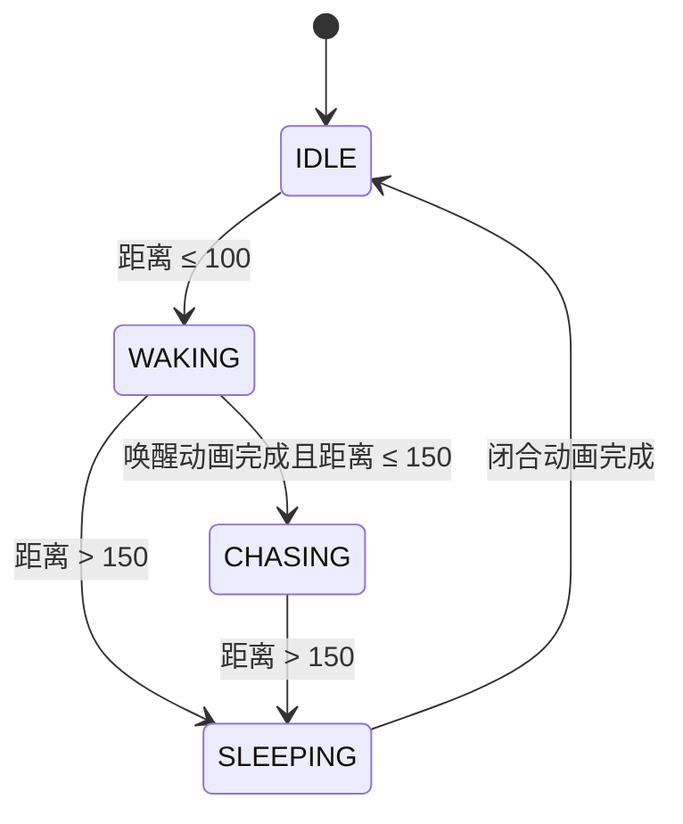

# 怪物声明：宝箱怪

状态：已实现并完成自动回归。更新日期：2026-09-17。

## 作用与玩法

宝箱怪是通过追逐和持续吸扯干扰走位的近距离威胁。平时保持闭合休息；玩家靠近后展开箱体，再追逐玩家。追逐时将玩家向自身位置拉动，压缩玩家绕开其他敌人的空间。玩家拉开足够距离后，宝箱怪停止移动和吸力，闭合并恢复休息；之后仍可再次被激活。

玩家始终保有移动控制。吸力作为额外速度叠加，向外移动会变慢，向内移动会更快，横向移动的轨迹会偏向宝箱怪。吸力本身不造成伤害；接触伤害沿用玩家已有的敌人接触判定。

设计上的应对方式：避免进入休眠宝箱的警戒范围；激活后利用自身速度拉开距离，或者优先击杀。多个宝箱怪的吸力按方向相加，可增强、抵消或改变吸扯方向；当前未设置总吸力上限，群体压制强度仍需实际游玩调优。

## 行为规则

距离使用双方根节点的世界坐标，单位为像素。**下表采用宝箱怪 `.tscn` 中的实际配置，优先于脚本默认值。**

| 参数 | 当前值 | 编辑位置 |
| --- | --- | --- |
| 唤醒范围 | ≤ 100 | 宝箱怪根节点 `wake_up_range` |
| 休眠范围 | > 150 | 宝箱怪根节点 `sleep_range` |
| 吸力范围 | ≤ 150，仅追逐时 | 子节点 SuctionAbility 的 `suction_range` |
| 吸力强度 | 20 像素/秒，范围内恒定 | SuctionAbility 的 `suction_strength` |
| 追逐最大速度 | 60 像素/秒 | VelocityComponent 的 `max_speed` |
| 移动加速系数 | 5 | VelocityComponent 脚本默认值 |
| 唤醒 / 闭合时长 | 各 0.6 秒 | AnimationPlayer 的 `wakeup` / `sleep` |
| 生命值 | 50 | HealthComponent 的 `max_health` |
| 接触伤害 | 每次 1，玩家侧间隔 0.5 秒 | player.gd 与 DamageIntervalTimer |
| 经验瓶基础掉落率 | 100% | VialDropComponent 的 `drop_percent` |
| 加入生成池 | 难度 8，通常第 40 秒，权重 5 | enemy_manager.gd |

100～150 像素是状态缓冲区：休息中的宝箱不会因为玩家处于这里而唤醒，已追逐的宝箱也不会立即休眠。这样可以避免玩家在同一条边界附近走动导致频繁开合。调整数值时保持 `sleep_range > wake_up_range`；若希望追逐期间始终有吸力，保持 `suction_range >= sleep_range`。



| 状态 | 表现 | 移动 / 吸力 |
| --- | --- | --- |
| IDLE | 闭合休息，播放 idle | 停止 / 关闭 |
| WAKING | 展开箱体，播放 wakeup | 停止 / 关闭 |
| CHASING | 跳动追逐，播放 chase | 追踪玩家 / 开启 |
| SLEEPING | 闭合箱体，播放 sleep | 进入该状态时立即停止 / 关闭 |

唤醒中远离也会取消激活。闭合期间重新靠近时，先完成闭合，然后重新判断唤醒。玩家节点消失时回到休息并关闭吸力；暂停时移动和吸力均暂停；宝箱节点释放后自动退出吸力源组。

## 代码实现

| 文件 | 职责 |
| --- | --- |
| `sences/game_object/mimic_chest_enemy/mimic_chest_enemy.gd` | 距离检测、四态状态机、追逐、动画完成后的状态切换 |
| 同目录 `mimic_chest_enemy.tscn` | 动画、外观、碰撞、生命、移动和吸力参数、组件绑定 |
| `sences/ability/suction_ability/suction_ability.gd` | 吸力开关、有效性和距离检查、吸力速度计算 |
| `sences/game_object/player/player.gd` | 每帧汇总活动吸力源，与玩家移动一起提交 |
| `sences/component/velocity_component.gd` | 合成移动并统一执行碰撞，避免吸力累积成永久速度 |
| `resource/Beastiary/mimic_enemy.tres` | 游戏内图鉴描述；图鉴菜单入口仍属于独立待完成事项 |
| `test/mimic_regression.gd` / `.tscn` | 使用真实玩家和怪物场景的自动回归入口 |

### 状态与动画

`enter_state()` 在同一处设置状态、吸力开关、停止速度和对应动画。追逐只由 `State.CHASING` 控制，不再由相互独立的 `isChasing` 与 `isPlayingAnimation` 布尔值组合决定。

`animation_finished` 负责 `WAKING → CHASING` 和 `SLEEPING → IDLE`。宝箱场景中旧的状态切换方法轨道已移除，视觉帧、追逐的跳跃/旋转/缩放动画保留。进入闭合前立即应用 RESET，避免追逐留下的形变带到闭合动画中。

追逐沿玩家方向加速，并通过现有 VelocityComponent 移动。保留项目现有 `_process()` 更新方式，没有迁移整个游戏的物理时机。宝箱仍与地形及其他敌人碰撞，**尚无寻路绕障**；被墙或敌群阻挡时，需要与本次修复的状态卡住区分。

### 吸力与玩家控制

追逐时 SuctionAbility 加入运行时 Group `suction_sources`，退出追逐时移出。玩家每帧查询所有活动源，每个源返回：

```text
拉动速度 = normalize(宝箱位置 - 玩家位置) × suction_strength
最终移动速度 = 玩家自身速度 + 所有有效拉动速度之和
```

这里实现的是持续外部速度偏移，不是无限累加的加速度。方向随玩家和宝箱的位置实时更新；超出范围或源正在释放时返回零。不额外乘 delta，位移积分由 `move_and_slide()` 完成。

VelocityComponent 的 `move(character_body, external_velocity = Vector2.ZERO)` 保持旧调用兼容。玩家合成后每帧只移动一次；碰撞继续交给 Godot。外部速度不写回持续的输入移动速度，吸力停止后不会留下漂移；碰到障碍时，输入速度仍按碰撞法线处理。

吸力开启统一使用 `turn_on_suction()`，无调用的旧拼写入口已删除。实验脚本的 `apply_suction()` 入口注册吸力源，不再从怪物脚本直接移动玩家。

当前吸力按距离判断，没有地形视线检测，因此墙后也可能存在指向宝箱的拉动速度，但碰撞会阻止穿墙。多个节点的处理顺序可能使状态变化在玩家下一处理帧体现，不存在额外持续计时器。

## “激活但不跑动”的原因与修复

旧 wakeup 动画的方法轨道顺序是：

1. 0.590 秒将 `isPlayingAnimation` 设为 false。
2. 0.595 秒调用 `play_chase()`，切走当前动画。
3. 0.600 秒才将 `isChasing` 设为 true。

如果一帧落在 0.595 与 0.600 秒之间，动画提前切换，最后一个方法键不会执行。表现动画已经是 chase，但 `_process()` 中的移动条件仍为 false。旧 sleep 动画也存在先切 idle、再清理动画锁的类似顺序风险。

本次在未修复副本中手动推进真实 AnimationPlayer：先推进 0.595 秒并等待延迟方法调用，再推进 0.02 秒，得到实际输出 `animation=chase isChasing=false`。因此这是已复现的状态/动画不同步问题，不是仅凭代码猜测。

还复现了第二次唤醒吸力仍为 false：旧实现只在休眠调用关闭，没有再次开启。新状态机每次进入追逐都会开启吸力，退出时关闭。

## 验证记录

使用 Godot `4.3.stable.official.77dcf97d8`，在独立项目副本和独立用户目录测试，未使用真实游戏存档。

- 在 30、60、144、240 固定处理帧率下，各通过 32 项断言。
- 包括动画末尾分帧复现、真实位置前进、三次完整唤醒/休眠循环、距离缓冲区和唤醒中远离。
- 包括静止玩家被吸引、反向移动逃脱、多源相互抵消、超出吸力范围、停止后无残留速度和地形不穿透。
- 包括暂停、吸力源释放、玩家释放的安全退出。
- 导入检查无脚本解析错误；回归运行无 `SCRIPT ERROR`。退出仍有此前已记录的 ObjectDB / 1 resource 未释放诊断，未在本次定位。
- 原战斗场景额外运行 1200 帧，观察到难度推进、经验拾取、受伤及死亡，退出码 0、无脚本运行错误；退出仍报告 ObjectDB / 25 resources 未释放。此冒烟未运行到宝箱自然生成时间，宝箱行为由上面的独立场景验证。

在按 [开发基线](../development/DEVELOPMENT.md) 准备好的隔离副本中运行：

```sh
"$GODOT_BIN" --headless --path "$CHECK_PROJECT" --fixed-fps 60 res://test/mimic_regression.tscn
```

失败断言输出 `FAIL` 并返回非零退出码，全部完成时输出 `MIMIC_REGRESSION failures=0`。这是自动测试场景，会自行退出；不要把它当游玩入口。它依然加载项目 Autoload，务必使用隔离存档。

以上验证覆盖行为与碰撞，不代替视觉观感、完整实战难度和触屏手感验收。
