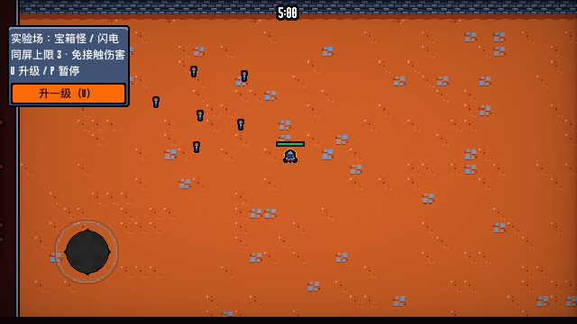
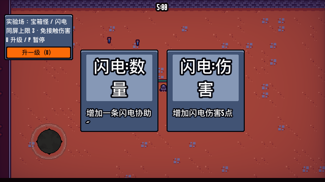

# 战斗实验场验证记录

日期：2026-09-20；引擎 `4.3.stable.official.77dcf97d8`。工作副本：`blood-combat-lab-0k0jft92/project`；存档目录标识：`Codex-blood-combat-lab-0k0jft92`。由隔离启动器自动创建，原项目设置和真实 `2DBlood` 存档未修改。

| 项目 | 结果 | 日志 |
| --- | --- | --- |
| 隔离启动器：宝箱怪＋斧头，240 帧 | 成功生成副本、独立用户目录与日志；退出有 3 个资源仍使用诊断 | [launcher.log](launcher.log) |
| 冷／热导入 | 冷导入复现已有字体／UI／音乐缓存缺失；热导入无错误／警告 | [cold](import-cold.log)、[warm](import-warm.log) |
| 实验场专项回归 | 本轮 250 项断言、0 失败，四种怪物和全部武器路径均覆盖；退出有 1 个资源仍使用诊断 | [regression.log](regression.log) |
| 火焰回归 | 34 项、0 失败；退出有 5 个资源仍使用诊断 | [fire.log](fire.log) |
| 宝箱怪回归 | 32 项 PASS、0 失败；退出有 1 个资源仍使用诊断 | [mimic.log](mimic.log) |
| 正式主场景，1200 帧 | 难度 1/2、拾取、玩家受伤与死亡结算实际执行，无脚本错误；退出有 25 个资源仍使用诊断 | [normal.log](normal.log) |
| Forward+ / Apple M4 短时渲染 | 宝箱怪＋闪电的实验场面板及真实升级卡可见；两张均为闪电方向；此次退出无诊断 | [visual.log](visual.log) |

专项回归验证：开局仅安装所选武器（无武器为零）；普通剑可关闭火焰；局长计时停止；难度 3/6/8/60 不改变指定怪物；补怪与上限；免接触伤害开关；一键升级进入真实暂停 UI，选择后恢复；全部分支升级至资源上限并检查最终控制器属性；满级不创建空窗口；正式模式初始七项升级和四类怪物规则保持。由于抽卡随机且每轮可用候选不同，后续运行断言总数可能变化，应以 `failures=0`、源码覆盖和完整日志共同判断。

画面检查使用隔离副本内的临时驱动调用同一实验场和一键升级入口，等待绘制后导出截图，没有改写正式场景。程序化选择验证不代表人工鼠标／触屏操作验收。

仍未验证：长时间运行、大量敌人性能、每种武器所有视觉朝向、完整通关、移动端与 Web 导出。退出对象／资源诊断与基线同类，但本轮未定位来源，不能据此声称零错误。闪电已有异步目标引用与暂停行为风险见 [闪电学习页](../../weapons/THUNDER.md)。
